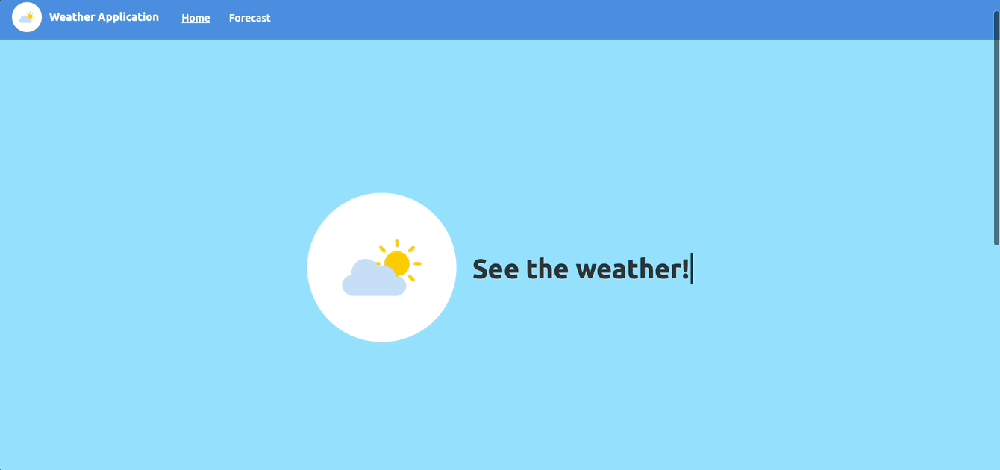

# Weather Website

<strong>Run the project here:</strong> [live application](https://weather-hcan.onrender.com)
⚠️ <strong>Note:</strong> The website may take a few seconds to load when accessed, as the hosting service(Render) needs a moment to start the server - this delay is normal and the website will appear shortly after⚠️

This is a small side project experimenting with full stack development. A web application that provides <strong>real-time</strong> weather information for any user-specified location by city name or zip-code. 
The project was build to practice with frontend development, backend server setup, API integration, and deployment.

## Features
- <strong>Weather Search</strong>: Users can input a city name or zip code to obtain their area's weather conditions in real-time. 
- <strong>Dynamic Data Display</strong>: The web application also displays a small icon describing the weather conditions(e.g.,"Cloudy", "Sunny", "Overcast") in the user-specified locaiton.
- <strong>API Integration</strong>: Uses JavaScript to send a HTTP request to a third party weather API and then parses the returned JSON response to obtain the weather data. 

### Weather Website Demo

### Technologies
- <strong>Frontend:</strong> HTML, CSS(Flexbox), JavaScript
- <strong>Backend:</strong> Python, Flask
- <strong>Templating Engine:</strong> Jinja
- <strong>Deployment:</strong> Hosted on Render using the Gunicorn server 

